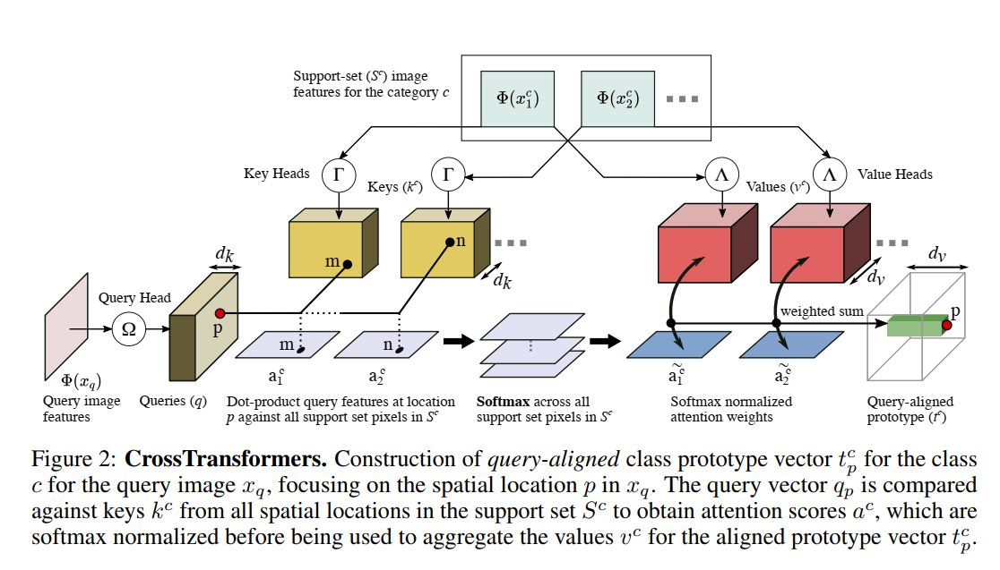

# CrossTransformers-PyTorch

Unofficial PyTorch implementation
 - [CrossTransformers: spatially-aware few-shot transfer](http://arxiv.org/abs/2007.11498)
    - Carl Doersch, Ankush Gupta, Andrew Zisserman
    - NeurIPS 2020

## Main contributions

- CrossTransformers Architecture
- SimCLR episodes

## Implementation details

- Resnet34, output feature map 14x14 by using dilated conv
- Higher image resolution (224x224)
- Strong data augmentation following [2]
- Normalized gradient descent
- 50% episodes of uniform category sampling

## TODO

- [x] CTX sanity check on miniImagenet
- [ ] CTX on Meta-Dataset [1]
- [ ] CTX + SimCLR Eps
- [ ] CTX + SimCLR Eps + Aug

## Acknowledgements

- miniImagenet experiments based out of DN4 [codebase](https://github.com/WenbinLee/DN4/blob/master/dataset/datasets_csv.py).

## References

[1] [Meta-Dataset: A Dataset of Datasets for Learning to Learn from Few Examples.](https://arxiv.org/abs/1903.03096)

[2] [Optimized generic feature learning for few-shot classification across domains.](https://arxiv.org/abs/2001.07926)
